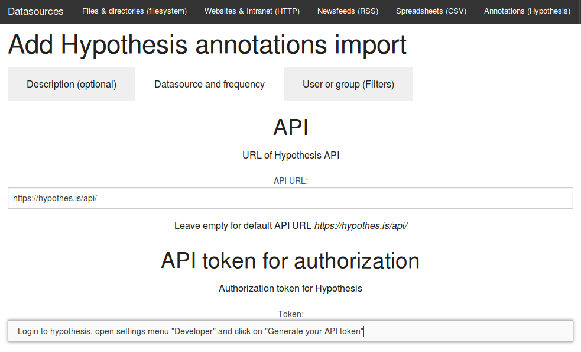

# Import Hypothesis web annotations, tags & documents to Solr and Elastic Search

## Integration of Hypothesis with Solr & Elastic Search

The [integrated Open Source visual annotation tool](../../doc/datamanagement/annotation/hypothesis) [Hypothesis](https://hypothes.is) provides a powerful visual user interface for (collaborative) web annotation and tagging by human editors (including teams and groups) that supports not only tagging documents and adding page notes, but allows you to annotate documents and web pages within the text, even for single words, names, parts of sentences, sentences or paragraphs.

## Import annotations and tags from Hypothesis for semantic search, faceted search, analytics & textmining

By the **web user interface** for **configuration of datasources** in the **tab Hypothesis** you can easily **setup the import / indexing of annotations, tags and annotated documents from the Hypothesis API** to the Solr or Elasticsearch search index for data enrichment of indexed documents in search index by hypothesis annotations and tags:

If you want to import private annotations, you must setup your private API token. You can find it in the settings menu "developer" when logged in to hypothes.is:

## Filters

In the tab filter(s) you can set from which user or group annotations should be imported. If you are using the public hypothesis web service, you must set such a filter to prevent import of all public annotations from all users of the web service.

## Full text search in document content with annotations and text

After setup of Hypothesis as a datasource and the first run of the import you can search with full text search the full document content combined/enriched with your notes and tags.

## Faceted search and interactive filters by Hypothesis tags

Additionally you get interactive filters for faceted search, text analytics and text mining by your hypothes.is tags.

## Automatic named entity recognition / named entity extraction for tagged or annotated documents and web pages

Additionally automatic analysis like Named Entity Recognition / automatic extraction of persons, organizations and places by machine learning will be done automatically for documents and web pages you tagged with Hypothesis.

## Limitations

Since Hypothesis doesn't support an export to standards like RDF (yet?), there is another plugin for the hypothesis API. The plugin is in early development, so there are some limitations yet:

Until implementation of API paging within the next weeks, the plugin imports only the last 200 annotations per user or group. So you have to set the delta time to a period where your last annotations are within this limit.
