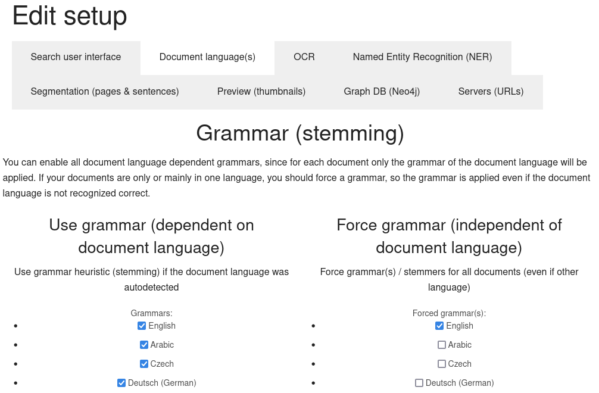

# Config

Standard installations and most parts should be usable out of the box without further configuration.

Many config options are set by a web user interface in the menu *Configuration*:



In most cases you don't have to configure complex (partially outdated) config file options described below:

# Search server

## Language of the index

If your language is not english and you don't use a localized package or virtual machine:

Most important because not changeable for yet indexed documents is to [change the language for stemming](stemming) before indexing documents.

# User interface

## Config file

The config file of the user interface is ***/etc/solr-php-ui/config.php***

## Language of the user interface

The default language is english.

To switch the language of the user interface to german set the option ***$language*** to *de*

```
# Set language to german
$language = "de";`

# Scheduler: Starting (re)crawls automatically
```

If you don't use [filemonitoring](../../../trigger/filemonitoring) (and even then you should sometimes recrawl, if something failed or was changed at a bad moment), you should recrawl data sources from time to time automatically.

If you use our connectors and want the most flexibility then use Cron and add a Cronjob using our [command line tools](../cmd) into a Crontab or you can call our [webservice (REST-API)](../rest-api) from a script or another webservice (i.e. webcron).

# File indexer

## Config file

The config file for indexing files is ***/etc/opensemanticsearch/connector-files***.

There you can enable OCR for images, like described below:

# Data enrichment: Enrich content

[Enhancers enrich the content with additional data, metadata or analytics](../../data_enrichment) (i.e. tags, OCR or named entity extraction), which helps to find better the original content, to filter or to navigate.

## OCR (automatic text recognition in graphical formats)

Automatic text recognition (OCR) is off by default, because it slows down indexing. It uses many processor ressources and will need many seconds for each graphic file.

### Enable OCR

(OCR is enabled by default in the virtual machine packages like Open Semantic Desktop Search or Open Semantic Search Appliance)

Install the package tesseract-ocr (included in your Linux distribution):
`apt-get install tesseract-ocr`

If you enabled OCR, should enable OCR for images inside PDF files, too, since many PDF files are scans and do contain much text data only as graphics:

Add (uncomment) the PDF OCR Plugin::
```
#Enable OCR for images inside PDF files

config['plugins'].append('enhance_pdf_ocr')
```

### OCR language

Setting OCR language to an other language than english:
1. Install the tesseract language package (for german: `tesseract-ocr-deu`). See the list of available languages for [Debian](https://packages.debian.org/search?keywords=tesseract-ocr) or [Ubuntu](http://packages.ubuntu.com/search?keywords=tesseract-ocr).
2. set option `ocr_language` to the language of your documents. Default is *eng* for english (in tesseract its *eng*, not *en*!). For german set *deu* (in tesseract its not *de*!):
```
# language for automatic text recognition (ocr)
#config['ocr_lang'] = "eng"
config['ocr_lang'] = "deu"
```

Or set the OCR language to multiple languages, which are used in your documents:
```
# language for automatic text recognition (ocr)
config['ocr_lang'] = "eng+deu"
```

## Enrich with metadata from RDF sources (Resource Desciption Framework)

In `/etc/opensemanticsearch/enhancer-rdf` you can configure servers or services for metadata (like annotations or tagging) which is accessable as open standard RDF (Ressource Description Framework) and map them to Solr fields or facets.

## Adding custom fields / custom facets

To be able to use external, independent and modular tools and components writing directly to the Solr index, there is more than one place to configure mappings of new fields:
* Your metadata plattform (i.e. [Drupal](../../../enhancer/rdf-drupal)) where you edit them or a scraping plattform where you read them saving the data in fields with fieldnames
* the connectors / importers and enhancers which read this data from the (meta) data source and write it to Solr
* and the user interface which reads this fields from Solr and shows them under a human readable label to the user.


You can configure additional facets (interactive filters):

### Mapping from database fields or RDF properties to custom fields / custom facets in Solr within the connector / importer / enhancer

Config in which Solr-fields to write the additional data from the (meta)datasource:

If you use a RDF datasource, find out the name / URI (in semantic Web and RDF the "field name" is an url, too) of the external fields (i.e. a standard fields (like *Dublin core* metadata standard fields) or a [custom field in Drupal](../../../enhancer/rdf-drupal)).

Add this external fieldnames or uris mapping them to a internal Solr field (standard fields, standard facets or [additional custom facets](../../../enhancer/rdf)) in */etc/solr/enancer-rdf*.

Example:`config['meta_property2facet'] = {
 'http://purl.org/dc/terms/location': 'location_ss',
 'http://semantic-mediawiki.org/swivt/1.0#specialProperty_dat': 'meta_date_dts'
}`
### Enable additional Solr custom fields / custom facets in the user interface


Config which of this new or additional Solr-fields should be shown in the user interface and under which caption:

Use the option *$cfg[facets]* in *config/config.php* to add custom facets in the user interface:
Setup additional Solr-fields (i.e. filled from below configurated connectors / importers or [enhancers](../../modules#enhancer) like additional [RDF Metadata](../../../enhancer/rdf) sources (i.e. your tagging and anntoation metadata server) or [fields in which you write scraped data](../../../solr-connector-scrapy)) and map them a human readable title / label.

Example:
```
// Additional facets (f.e. fields imported by a connector or enhancer which should be shown as interactive filter in the sidebar)
$cfg['facets']['yourfacet_s'] = array ('label'=>'Additional own facet');
$cfg['facets']['anotherfacet_s'] = array ('label'=>'Another additonal facet');
```
