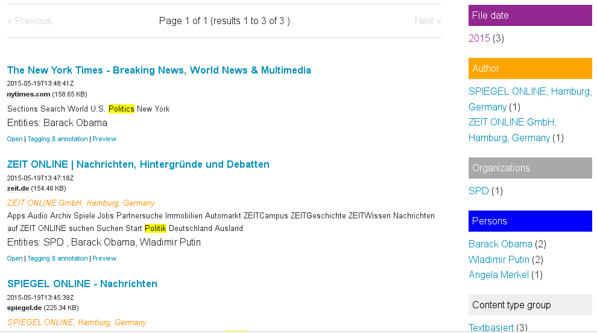

# Analyze and explore (Analytics, Exploratory Search, Text Mining, Topic Modeling and Datavisualization)

## How to analyze, explore and datamine big document sets by Exploratory Search, Faceted Search, Entity Extraction and Text Mining (Datamining by Text Analysis, Natural Language Processing, Machine Learning and Clustering)

There are user interfaces and views (just press the button/switch to the tab) for the following analysis and exploration for the results of a search query / search context or if no search query or filter is set, for all indexed documents:

## Aggregated overview (who, when, where, what, how often)

[Aggregated overview and named entities](../search#faceted_search) in the right sidebar shows you: Who? Which organizations? What? Where? When? In how many documents?

## Preview extracted text of document content

The preview shows the extracted text of a document. Search context like the search query or active filters are marked within the content, so you can see fast whats important for you and why this document matched your query.

## Visualize locations occur in documents on Interactive map

By the view / tab "Map" you can analyze visual which locations occur in the documents of your search results:

.

## Networks, relations and connections (graph)

The [graph view](graph) generates data visualizations of networks, connections and relations between named entities like persons, organizations or tags from the content of your documents.

## Trend chart datavisualization (how many documents when)

[Trend chart](../analyze/trend): When how many results or documents?

## Table (all fields/columns/facets, minimum and maximum)

The [Tables view](../search/table) shows and can sort fields and get the maximum value and minimum value, the average and the median of each field/column

## Word list and word cloud (words)

[Word list and word cloud](words): Most used words, concept or names

## Text mining and topic modeling (content analysis)

[Text analysis, text mining, document mining and words](textmining): What is the content about?

## Similarity and differences (text comparision and overrepresented terms)

Please donate:

Show differences and focal points, core areas and key aspects by comparing word frequencies to find out what concepts or entities are overrepresented in documents in comparison to other documents or text corpus.

Compare two texts / versions to show differences or same/copied passages.

Connected words / Co-occurrences (N-Grams like Bigrams or Trigrams)

Search with a whole document or text as a search query:
Find similar text or documents about the same topics by klicking on "more of that".
