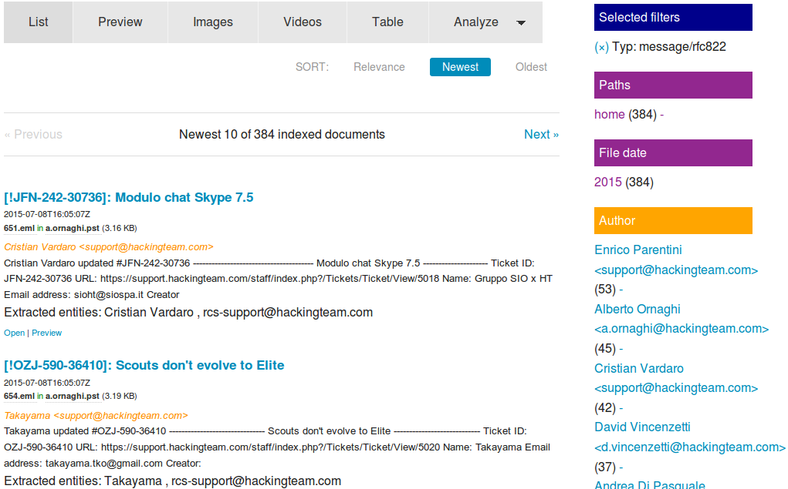

# Emails and file attachments in Outlook mailbox files (PST)

## Extract mailbox files mail by mail

The plugin *Enhancer Outlook mailbox* will index *Microsoft Outlook* mailboxes (*PST* files) not only as one file but each included email for each (using the tool [readpst](https://packages.debian.org/jessie/pst-utils)).

## How to index Microsoft Outlook mailbox files

Just index the Microsoft Outlook file (.pst) like other files or documents:

For example copy it to the documents directory of Open Semantic Desktop search and start "Index documents".
Or use the "Index for search" in your file managers context menu.
Or copy the file to a filemonitored directory of your file server.
Or start a crawl of this file or its directory by Web user interface or command line tool.

After some time of data analysis and indexing you can use [fulltext search, filter and analyze](../../search) included emails for each, not only the mailbox file itself as a whole.

## File attachments

Mail attachments will be indexed, too.

All data enrichment or data analysis plugins like OCR run for content of file attachments, too.

So you can search, filter and analyse the content of mail attachments, too.

## Aggregated overview for analysis and Interactive filters

Since the meta data like email-adresses will be available for each mail, you can use [aggregated overviews and interactive filters (facets)](../../search#faceted_search) like "Message from" or "Message to" for indexed emails to find or filter the email you search for faster.

Network visualization for visual analysis
So you can [visualize the network with the graph view](../../analyze/graph) to overview who is connected and to see who wrote whom how often.

Roadmap

Next steps todo (please [donate for further development](../../../donate)):

Aggregated overview and interactive filter for domains

So you can overview, analyze, filter and visualize which organization mailed with which how often, not only for special email-adresses or people.

