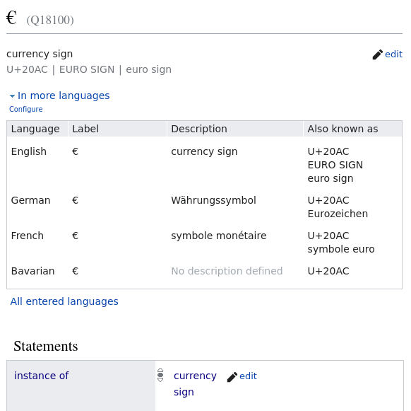
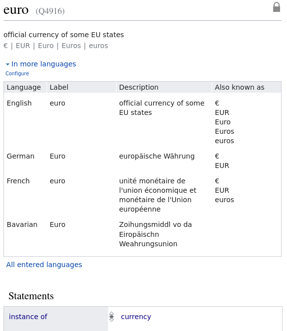
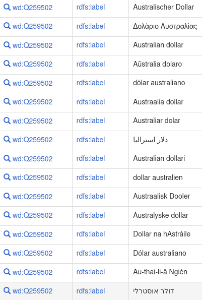

# Automatic extraction of money and currencies

Open Semantic Search extracts amounts of money from text to the facet "Money" and currencies to the facet "Currencies".
For example text parts of your documents like "*100 dollars*", "*1,000$*", "*$ 100.50*" or "*100 USD*" are extracted to the facet "Money".

So you can overview (facets) and drill down / filter your search results to documents concerning money.


## Open Source ETL money extraction plugin

For that purpose the [Open Semantic ETL (extracts documents full text to more structured data and search index)](https://github.com/opensemanticsearch/open-semantic-etl) open source [plugin "extract money"](https://github.com/opensemanticsearch/open-semantic-etl/blob/master/src/opensemanticetl/enhance_extract_money.py) is based on and combines multiple natural language processing (NLP) and textmining methods like ontology / SKOS thesaurus / dictionary based entity extraction and regular expressions (regex) for extraction of numbers with (fully integrated) open data from the free knowledge graph Wikidata to extract money amounts and currencies in multiple variants from the full texts of your documents.

So by this dictionary- and text-pattern (Regex)-based approach it often extracts additional structured information concerning money where the [machine learning approach by Named Entity Recognition (NER)](../../datamanagement/named_entity_recognition/README.md) failed on prediction of the NER class <code>money</code>.


## Currency signs

The plugin is configured with [currency signs](https://www.wikidata.org/wiki/Q308229) like for example the [Dollar currency sign](https://www.wikidata.org/wiki/Q11110) <code>$</code> or the [Euro currency sign](https://www.wikidata.org/wiki/Q18100) <code>€</code>.


## Currency labels

Another main approach is the extraction of currency labels (f.e. "Dollar", "Euro" and their aliases like "US Dollar", "USD" or "EUR") by our integrated currencies thesaurus.

This Simple Knowledge Organization System (SKOS) standard based thesaurus of currencies is an export of results of a [Wikidata SPARQL query for labels, synonyms and alternate labels of currencies](#sparql-query) extracted from the Wikidata knowledge graph / ontology.




## Extract currency labels and aliases by thesaurus (dictionary based named entity extraction)

Since this SKOS thesaurus of currencies is preconfigured in [Ontology Manager](../../datamanagement/ontologies) (Python/Django UI for import data from SPARQL/RDF to Solr Texttagger) of the semantic search engine, this step was yet done by the ETL plugin for dictionary/thesaurus/ontology based extraction of labels of entities from full text by [OpenRefine Reconciliation API Standard](https://reconciliation-api.github.io/specs/0.1/) based [Open Semantic Entity Search API](https://github.com/opensemanticsearch/open-semantic-entity-search-api), Solr providing a REST-API for managing these entities with labels and entity IDs/URIs in a Solr index and [Solr text tagger](https://lucene.apache.org/solr/guide/8_0/the-tagger-handler.html), a Finite State Transducer (FST) based dictionary matcher REST-API to extract this indexed labels / substrings from full text.


### Knowledge Graph based on Open Data from Wikidata

The used currency ontology includes different currency labels and aliases like "US dollar", "EUR" or "Euros":



For getting the [open data list / thesaurus of currency labels and their alternate labels/aliases](https://github.com/opensemanticsearch/open-semantic-search-apps/blob/master/var/opensemanticsearch/media/ontologies/currencies.rdf) we [query, extract and import Open Data of entities from Wikipedia from the the free universal knowledge graph Wikidata](../../datamanagement/opendata/wikidata) by the following **SPARQL query** returning RDFS labels and SKOS thesaurus alternate labels:


#### SPARQL query

Get labels from all instances of type **currency** (Wikidata Entity [`Q8142`](https://www.wikidata.org/wiki/Q8142))

```
PREFIX skos: <http://www.w3.org/2004/02/skos/core#>
CONSTRUCT {
 ?uri rdfs:label ?label ;
 skos:prefLabel ?prefLabel ;
 skos:altLabel ?altLabel .
}

WHERE {

 ?uri p:P31/ps:P31/wdt:P279* wd:Q8142.

 OPTIONAL {
 ?uri rdfs:label ?label .
 }
 OPTIONAL {
 ?uri skos:prefLabel ?prefLabel .
 }
 OPTIONAL {
 ?uri skos:altLabel ?altLabel .
 }
}
```


## Extraction combines numbers with currency signs or currency labels to facet money

As last step all approaches are combined by a [Regular expression](https://en.wikipedia.org/wiki/Regular_expression)
which matches numbers which are combined with extracted currency label before or after a number (text pattern based extraction).

So from this [Regex](https://docs.python.org/3/library/re.html) matches we get money like "100 dollars" for the facet "Money".
