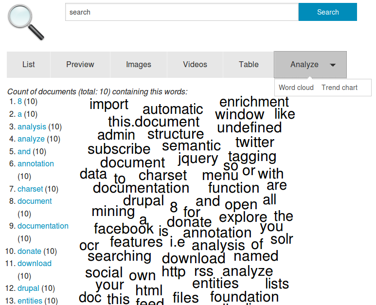

# Text mining, text analytics and content analysis

## Text data mining (TDM) by text analysis, information extraction, document mining, text comparison, text visualization and topic modelling

The search engine extracts automatically texts of different file formats and uses [grammar rules (stemming)](../../admin/stemming) to index and find different word forms.

On this base and index you can search, review, filter, analyze and mine content with different text mining, analysis, extraction, data mining and clustering methods.

So you can use the search engine not only for information retrieval by full text search to search and find known issues or to get structured data from unstructured data sources or texts by information extraction. It can be used as integrated text mining toolbox for text datamining (TDM) for semi-automated or automated text analysis, document mining, text comparision, text visualization and topic modelling to get useful analysis results even of unknown data sources.

## Search and filter the interesting documents

If you don't want to analyze all indexed documents, you can [search and filter the context](../../search) you want to mine and analyze.

## Words: Word list and word cloud

The view *Words* (option of the tab/button *Analyze*) shows you the words which are contained in the most documents of the results of your search context (documents matching your search query and filters).

If you do not enter a search query and don't use a filters it shows the words which are contained in the most of all indexed documents.

The number shows you how many documents (matching your search query and filters or if no search query or filter of all documents) use this word.

If you click on a word, this word will be added as an additional filter.

The words are visualiszed as a word cloud. The more documents containing the word, the bigger it is in the visualization

## Aggregated overviews of extracted structured informations, named entities and concepts for exploratory search (thesaurus based, ontonologies based and machine learning for automatic classification based faceted search)

With the [**faceted search** you can see an aggregated overview for the different facets](../../search#faceted_search) like paths, concepts, persons, locations or organzations showing, how many documents matching the named entities.

This structure will be generated and facets/fields are valued with data from the following analysis:

* Lists of Named Entities: Listed known [named entities like organizations, persons, locations or concepts. They can be [managed in plaintext lists, databases, ontologies, thesauri or in the [thesaurus user interface](../../datamanagement/thesaurus) for dictionary based or thesaurus based text mining and thesaurus based faceted search](../../datamanagement/ontologies)](../../datamanagement/thesaurus)
* Annotation & Tagging: [Tags from (collaborative) annotations and tagging](../../datamanagement/annotation)
* Text patterns (Regular Expressions): Extraction of structured data or data enrichment with [text patterns (regular expressions) can extract informations like email-adresses or amounts of money. They are added to facets like Email adresses, From:, To: or money.](../../../enhance/regex)
* [Named entity extraction or Named entity recognition (NER)](../../admin/config/named_entity_recognition) of even yet unknown entities like persons, organizations or locations by automatic classification of this text parts by machine learning on an annotated training corpus model
.

## Topic modelling (clustering and differences)

Please [donate](../../../donate) so we can implement this sooner):

Topic modelling (clusters of topics what about documents are)

What are the contents about? What are the most common topics in the whole, selected or filtered document set?

Coocuration (Connected words): Which words occure together (Bigrams/Trigrams/N-Grams)?

What is special in comparision with another text or document set ? See "Compare text or part of the corpus with other text or part of corpus".

## Similarity ("more like this")

Please [donate](../../../donate) so we can implement this sooner):

Search with a whole document or text as a search query:

If not yet, index your document which should be used as search query.

Search for that document (i.e. by filename).

Find similar text or documents about the same topics by clicking on "more like this".

## Direct text comparision: Differences of two text versions (visualization of added, deleted or copy pasted parts)

Compare two texts / versions to show differences or same/copied passages or deleted or added words.

Please [donate](../../../donate) so we can implement this sooner:

## Document set comparision (show differences like overrepresented terms)

Please [donate](../../../donate) so we can implement this sooner:

Special focus of a text or document set (text corpora) by comparision with other text or document set (text corpora).

Show differences and focal points, core areas and key aspects by comparing word frequencies to find out what concepts or entities are overrepresented in documents in comparison to other documents or text corpus.

## Extract text patterns with Regular Expressions (RegEx)

You can extract some structured data i.e. for aggregated overviews, interactive navigation and interactive filters (faceted search), data analysis and data visualization from unstructured text by extraction of the interesting text parts to structured flields, properties or facets by defining [text patterns with regular expressions (RegEx)](../../../enhancer/regex) or own [regular expressions based enhancer plugins](../../../dev/enhancer/python#regex)
## Advanced text analysis, text mining, document mining and text visualizations

Advanced features like clustering and network analysis and advanced visualizations need more CPU load, more parameters and knowledge and specialized tools for different analysis, so you have to start them manually for your documents or for special search context.

But many advanced text mining tools support only few document formats and data formats and do not optical character recognition (OCR) automatically.

Since this free software is interoperable open source software and uses open standards you are free to integrate additional data enrichment or data analysis plugins or to use other specialized tools additionally and based on the (exportable) text extraction, data enrichment, search and filter results of the search engine.

## How to explore and analyse a document collection with external text mining tools?

After automatic extracting, indexing, analysis (i.e. optical character recognition by OCR engines) and enriching (i.e. with Named Entities or extraction of email-addresses) you can do an advanced text analysis, text mining and document mining with this special tools based on an export of all data or an export of search results or filtered results:

* [Search and filter/drill down](../../search) the interesting document set (or do not, if you want to analyze all documents)
* Export this search results to a CSV file. Select the interesting fields like *id*, *title*, persons, organzations and mainly the fields *content* and *ocr\_t*
* Import the CSV in [other open source text mining tools](#alternates) and use the extracted text data with natural language processing (NLP) or machine learning (ML), named entities recognition (NER) or classification libraries until some of its advances machine learning [methods for text mining](https://en.wikipedia.org/wiki/Text_mining) are integrated into the user interfaces
* Use their advanced features and views, for example different [views from Jigsaw](http://www.cc.gatech.edu/gvu/ii/jigsaw/views.html)

## Free Software and Open Source text analytics and text mining toolkits and platforms or text mining solutions

Alternate Free Software and Open Source text analytics and text mining toolkits or text mining platforms:

### Text mining platforms

* [Gate](https://gate.ac.uk/) - General architecture for text engineering

### Open source components for natural language processing (NLP), clustering and classification (machine learning)

Open source frameworks & programming libraries or APIs for natural language processing (NLP), clustering and classification (machine learning):
* [Apache Solr](http://lucene.apache.org/solr/) (Java based REST-API)
* Elastic search
* [Apache UIMA](https://uima.apache.org/) - Unstructured Information Management Architecture for information extraction
* [DKPro](https://dkpro.github.io/) - Text mining framework (Java and UIMA)
* [OpenNLP](http://opennlp.apache.org/) - Command line tools and Java library
* [Python Natural Language Toolkit (NLTK)](http://www.nltk.org/) - Natural language processing library (Python)
* [Gensim](http://radimrehurek.com/gensim/) - Topic modelling programming library (Python)
* [Mallet](http://mallet.cs.umass.edu) (Java)
* Apache Mahout (Java)
* Apache Spark (Java, but APIs for Pyton, too)
* Apache Stanbol

More: [Text Analysis Portal for Research](http://tapor.ca/) or in [Wikipedia list of text mining software](https://en.wikipedia.org/wiki/List_of_text_mining_software)