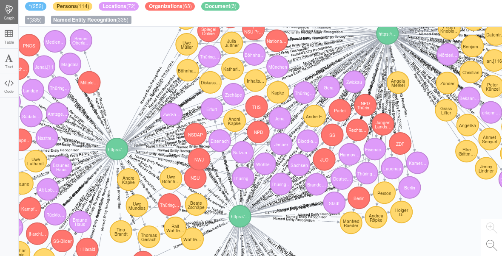
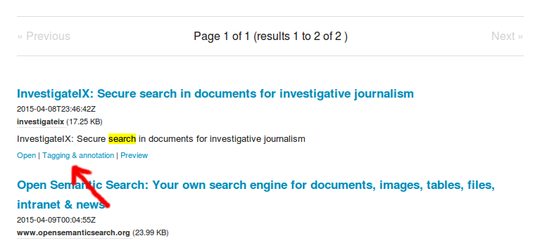

# Annotation and tagging

If a name and no of its aliases or a word and no of its synonyms is not contained in the document, that doesn't mean, that the document is not important for this topic.

If you tag a document with a tag (f.e. a name of a person, organization, location or a concept or word), this document will be found on further queries with this word(s) even if this word(s) is/are not contained in the document or would be not recognized by automatic text analysis.

## Why (collaborative) tagging and (collaborative) annotations by (teams of) human editors?

Even if text mining and text analytics technology like automatic [named entity recognition of persons, organizations or places](../named_entity_recognition) and interactive filters and automatic topic detection by thesaurus for content analysis is very helpful to automate much of the editors work, no automatic text analysis, [OCR](../ocr) or machine learning model is perfect.

## Human knowledge better than artificial intelligence, OCR and automatic ranking algorithms

So as specialists, domain experts or thinking human you and your team can add words, interpretations, qualitative values or structure that can not be analysed automatically because there is no data enrichment or automatic analysis plugin for that issue or its automatic analysis is not good enough, since computers are dump and can not understand or decide every context.

## Find, analyze and filter tagged documents by faceted search

Additionally, tags will be used for [faceted search and exploratory search like like aggregated overviews and interactive filters for navigation](../../search#faceted_search), too, so you get an overview and you can find and filter or drill down tagged documents faster and with more comfort.

## Your research team or users will find yet analysed and tagged documents despite codes, euphemism and lies

If a name and no of its aliases or a word and no of its synonyms is not contained in the document, it doesn't mean, that the document is not important for the topic. For example corrupt companies or politicians wont write the word corruption into their documents, even if the document is a evidence of corruption.

If you tag a document with a tag (f.e. a name of a person, organization, location or a concept or word), this document will be found on further queries with this word(s) even if this word(s) is/are not contained in the document.

## Connect knowledge

Maybe you search for a connection of two special topics, for example for racism in an organization.

Your search would find anything.

Maybe a specialist tags a document with the tag racism because he knows, that a special code is for racism.

Maybe another specialist has an idea about members of the organization and tags the document with the organization.

Now you will find the document if you search for that organization in context with topic, even if the specialists added their knowledge for only one topic or domain without deeper knowledge about the other one.

## How to tag or annotate a document?

* Just click *"Tagging and annotation"* for this document in the search results to annotate this document.

* Add tags (f.e. concepts, persons, organizations or locations) or write some free text into the notes field.

* Save the annotation. This will trigger to index the document again, so some seconds later this document is findable and filterable in the tagged context(s), too.

## Visual annotations

If you want to annotate visual and only parts within documents or web pages, you can use [Hypothesis annotation tools for visual annotations and tagging](hypothesis).

## Automated tagging and automated annotation

Such manually tagging by human editors, teams or groups is for documents that doesn't contain the tag (or another word or query or aliases) within the content, so that a human has to classify it to this additional context(s).

If you want to tag documents i.e. with Tags like organizations, persons, locations or aliases that are in the text for sure without potential technical problems (works only if for sure if without OCR errors, typos or alternate and/or yet unknown labels or codes), you can add this tag or name to the [Thesaurus or Named Entities Manager](../thesaurus) which will tag all documents containing the name, concept or query automatically and for new documents, too.

## Alternate annotation tools for semantic annotations

You can integrate enhanced annotation tools for semantic annotations, which can not only tag whole documents but even parts of them:
* [Neonion](http://neonion.org/)
* [Pundit](http://www.thepund.it/)
* [Hypothesis](http://hypothes.is/)
* [AnnotatorJS](http://annotatorjs.org/)

