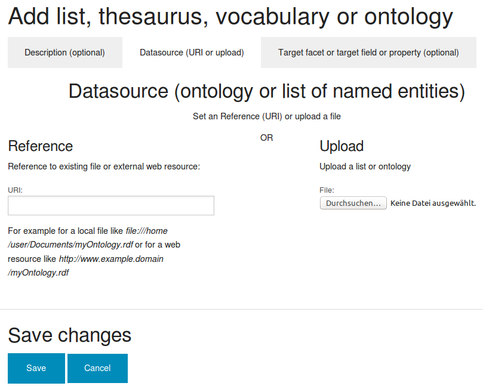
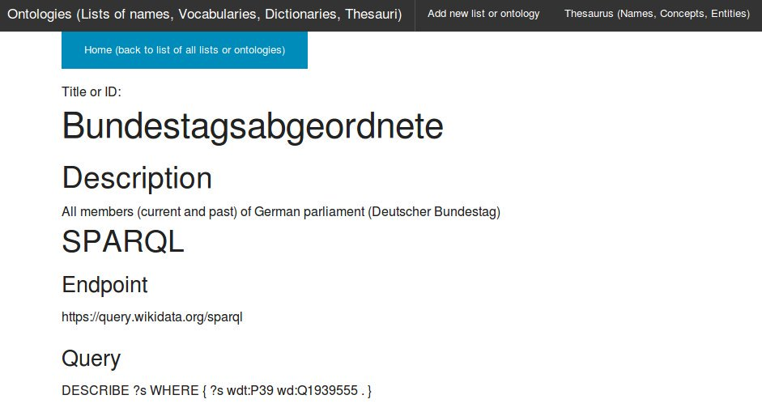

# Import lists of names from Wikidata knowledge graph


## Import lists of names from Wikidata for analytics of your document sets, structure of navigation, interactive filters and aggregated overviews


[Open Data](#opendata) from Open Access databases like [WikiData](#wikidata) (structured data and universal knowledge graph from Wikipedia in open standards for linked data and semantic web) can be used to improve search, analysis, filtering and navigation of your [private documents, news and data](#privacy).

This tutorial describes how to [import multilingual lists of names from Wikidata](#import) as universal ontology, knowledge graph or [thesaurus](../../thesaurus) to
* [see / overview which of these names occur in your document sets or search results (aggregated overview)](#aggregated_overview)
* get [interactive filters for your documents by this names or entities](#interactive_filters) like persons (for example [all politicians of your parliament](#politics)), organizations or locations
* automatically [find aliases or the same names written in other languages, too](#altlabel)
* configure [alerts, feeds or leads for new documents where important concepts or people occur](#leads) by search or filter for/of that lists/facet


## Wikidata as open data database and knowledge graph for fine granular structured multilingual linked data


If there is an existing list, dictionary, vocabulary or thesaurus or if the entries are available in other structured format like an semantic web ontology yet from open data sources like Wikidata, you don't need to enter manually each named entity like persons, organizations, locations or important words or concepts to the [thesaurus](../../thesaurus) to use them for [analytics, navigation, aggregated overview and interactive filters](../../../search#faceted_search).

One of the biggest and an universal [Open Data](https://en.wikipedia.org/wiki/Open_data) source is [WikiData](https://www.wikidata.org), the multilingual structured database from Wikipedia.

From this multilingual and fine granular structured datasource you can [select and download](https://query.wikidata.org) lists of names for example of people like [politicians](#politics) for your analysis of document sets & news, interactive filters (faceted search) or alerts.


## Automatic tagging with named entities in list like names of people or organizations from Wikidata


[](../../../../screenshots/faceted_search.png)
Using this list of important names or ontology the [named entities tagger](../../thesaurus) is tagging documents in which this names occur.


## Leads for research by matching watchlists


So you get leads for potential relevant documents where important concepts or people on such a watchlist or ontology occur, i.e. if analysing a large unknown document set or dataset or after getting new documents or news.


## Analytics, aggregated overviews and exploration


By the faceted search you get an aggregated overview for the different facets like concepts, persons, locations or organizations showing, how many of the found or all documents matching this entity.


## Interactive filters (faceted search)


You can use this overviews or named entities as interactive filter to narrow down search results.
So a click to a facet (i.e. an organization) will drill down the search results to fewer documents, matching this additional facet/filter, too.

## Multilingual labels, alternate labels and aliases for Semantic Search


Since the used open standards for Semantic Web and Linked Data labels like names can be multilingual, so you will find the names in different languages.

So for example after import of names of politicians from Wikidata the semantic search for *Angela Merkel* will find documents which contain *Angela Dorothea Kasner*, too, which is birth name of *Angela Merkel* before she married.

Additionally documents which contain *Angela Merkelowa* or *Ангела Меркель* will be found, too, which is *Angela Merkel* written in russian language.


## Open Standard for linked data and interoperability


Since Wikidata is using open standards for Linked Data and interoperability of the Semantic Web, the structured data in XML/RDF format and linked data by RDFS and SKOS thesaurus standard is interoperable and can be used for configuration of interactive filters and analytics of your document set in Open Semantic Search out of the box.


## Import list or ontology or define Wikidata query


So you can [import existing, shared or external list of names, thesauri, dictionaries, vocabularies or ontologies](../../ontologies):



## SPARQL query and SPARQL endpoint (triplestore)


Instead of uploading or referencing an yet downloaded graph or list of names, you can configure a SPARQL query on a triplestore (SPARQL endpoint) in the datasources user interface for ontololgies in the tab "SPARQL":



Therefore you have to use SPARQL queries with CONSTRUCT (like you can see in our [SPARQL example queries](#examples)) or DESCRIBE (warning: much more overhead if the knowledge graph has more properties and linked data than only properties and data of a thesaurus) so the SPARQL results includes the following standard properties that are used for analytics: `rdfs:label` and/or `skos:altLabel` and/or `skos:hiddenLabel`
## Plain text lists


If you work only with one single language you can export the results of a SELECT query for only a single field/property in CSV format (only one field, so you get a plain text list instead of a table) and import/upload/reference this plain text list of names to the Lists and Ontologies Manager, which is much more performant for this case, because you save download bandwidth and CPU resources while import.


## Privacy & data protection


Open Semantic Search sends only the queries of the defined lists to the internet or linked data cloud and downloads the lists of names.

Different to common cloud services for named entity recognition, all other computing is done by open source software on your own computer or server without giving away sensitive informations like document content, search queries and how often and what has been found.

If even this list queries are sensitive information you can do downloads manually over Tor and import the data from the saved local files/graphs/lists by referencing or uploading them to the ontologies manager.


# Wikidata SPARQL queries examples


SPARQL Endpoint: `https://query.wikidata.org/sparql`

## Politicians


### Germany (german politicians)


#### Members of german parialment


##### Deutscher Bundestag (Bundestagsabgeordnete)


Current and former members of German parliament (Deutscher Bundestag) (>4000 names):
````

PREFIX skos: <http://www.w3.org/2004/02/skos/core#>
CONSTRUCT {
	?uri rdfs:label ?label ;
	     skos:prefLabel ?prefLabel ;
	     skos:altLabel ?altLabel .
}
WHERE {
	?uri wdt:P39 wd:Q1939555 .
	OPTIONAL {
		?uri rdfs:label ?label .
	}
	OPTIONAL {
		?uri skos:prefLabel ?prefLabel .
	}
	OPTIONAL {
		?uri skos:altLabel ?altLabel .
	}
}

````

The following SPARQL alternate using DESCRIBE would work, too, but is not recommended and would cause much more overhead if the knowledge graph has more properties and linked data than only thesaurus properties and data (like it is the case with Wikidata, which is a universal knowledge graph with many different properties, not "only" a thesaurus with labels and only a few types of relations):
~~`DESCRIBE ?uri WHERE { ?uri wdt:P39 wd:Q1939555 . }`~~
##### Landtag (Landtagsabgeordnete)


###### Baden Württemberg


Current and former members of Landtag Baden-Württemberg:

````

PREFIX skos: <http://www.w3.org/2004/02/skos/core#>
CONSTRUCT {
	?uri rdfs:label ?label ;
	     skos:prefLabel ?prefLabel ;
	     skos:altLabel ?altLabel .
}
WHERE {
	?uri wdt:P39 wd:Q17481175 .
	OPTIONAL {
		?uri rdfs:label ?label .
	}
	OPTIONAL {
		?uri skos:prefLabel ?prefLabel .
	}
	OPTIONAL {
		?uri skos:altLabel ?altLabel .
	}
}

````
### List of politicians of other countries or parliaments


To find out more about queries for politicians of your country or your countries politicians are not yet available for download, you can help to add them to Wikidata in the working group [Every Politician](https://www.wikidata.org/wiki/Wikidata:WikiProject_every_politician).