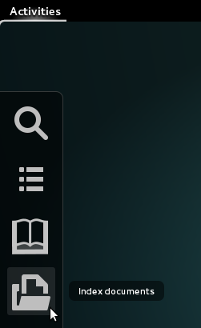

# Open Semantic Desktop Search (VM)

## Free software for your own desktop search engine for full text search, exploratory search and text analysis on Windows or Mac

Open Semantic Desktop Search is **free open source software** for your own **desktop search engine** with integrated text analytics and research tools for **full text search, exploratory search & text mining** in large document sets, many PDF files, Word documents and many other file formats on Windows or Mac.

## Desktop search engine package as virtual machine for single Linux, Windows or Mac users

The free software *Open Semantic Desktop Search* based on *Open Semantic Search* is the **all in one package for desktop users** (including Solr search server, user interfaces, open source search tools and connectors) **as virtual machine image** for [full text search, exploratory search, analytics and text mining in many documents](../search) on your own desktop computer or notebook on *Linux*, *Windows* or *iOS (Mac)*.

## Installation and configuration

Like described in the [tutorial with screenshots how to install and configure the Open Semantic Desktop Search virtual machine](../admin/install/desktop_search/README.md) just import the appliance file into Virtual Box and in the settings of the virtual machine add shared folders pointing to your documents directory or directories.

## Starting the search engine

* Start [*Virtual Box*](https://www.virtualbox.org)
* Start the virtual machine (VM) "*Open Semantic Desktop Search*"

## Search, explore and analyse

Use [powerful research tools for full text search, exploration, discovery, analysis, text mining and document mining](../search/README.md)

## Index documents

Indexing documents from all configured shared folders will be started automatically after starting the Desktop Search virtual machine.

You can index new documents which were added after the start of the virtual machine without need to restart:

- Click or touch the menu *Activities*.

  

- Click or touch the launcher "*Index all documents for search*" for recrawling all documents and subfolders in your document folder

  

## Launch the search user interface

The search interface will be started automatically after new documents were added to the document processing queue.

If you close the browser, you can open the search interface again:
Launch the search user interface by clicking the launcher "*Search for documents*" or one of the other powerful research tools.
