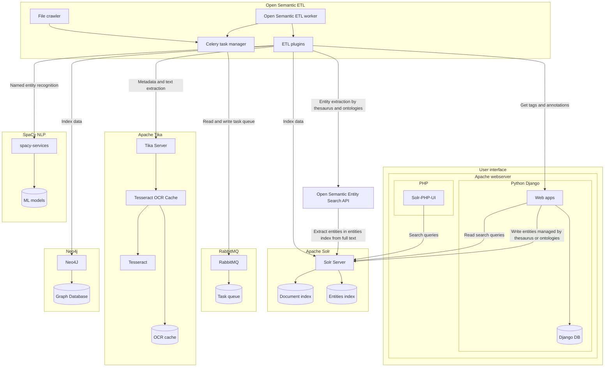

# Search engine components and architecture

**Open source search engine architecture (components and modules) and processing (data integration, data analysis and data enrichment)**

# Architecture overview

## Overview of services and main components

The relations in this chart show dependencies and connections between services and main components witch show different directions than the data flow (see another [flowchart of document processing and data flow](#flowchart-of-document-processing-and-data-flow)).

## Flowchart of document processing and data flow

```mermaid

flowchart TD

FILEMONITORING[Filesystem monitoring]
click FILEMONITORING "../../trigger/filemonitoring/"

FILEMONITORING-->|Immediatelly add task if changed or new file| CELERY

SCHEDULER[Cron scheduler]
click SCHEDULER "https://github.com/opensemanticsearch/open-semantic-search-apps/blob/master/etc/cron.d/open-semantic-search"

SCHEDULER -->|Regularly start crawler| FILECRAWLER

FILECRAWLER[File directory crawler]
click FILECRAWLER "https://github.com/opensemanticsearch/open-semantic-etl/blob/master/src/opensemanticetl/etl_filedirectory.py"

FILECRAWLER -->|Add task for each new or changed file in crawled directory| CELERY

CELERY[Celery task manager]
click CELERY "../admin/queue/"

CELERY -->|Parallel processing of files by multiple ETL workers| ETL_WORKER
CELERY --> RABBITMQ

RABBITMQ[(RabbitMQ task queue)]
click RABBITMQ "../admin/queue/"

RABBITMQ --> CELERY

ETL_WORKER[Open Semantic ETL worker]
click ETL_WORKER "https://github.com/opensemanticsearch/open-semantic-etl/blob/master/src/opensemanticetl/tasks.py"

ETL_WORKER -->|Running configured plugins one by one| TIKA

subgraph TIKA [Apache Tika for text extraction and metadata extraction]
  direction LR

  TIKA_PLUGIN[ETL plugin calling Tika]
  click TIKA_PLUGIN "https://github.com/opensemanticsearch/open-semantic-etl/blob/master/src/opensemanticetl/enhance_extract_text_tika_server.py"
  
  TIKA_PLUGIN -->|Document file| TIKA_SERVER

  TIKA_SERVER[Apache Tika Server]
  click TIKA_SERVER "https://github.com/opensemanticsearch/tika-server.deb"
  
  TIKA_SERVER -->|Image files or images in PDF|OCR
  TIKA_SERVER -->|Extracted text| TIKA_PLUGIN
  
  OCR[Tesseract OCR]
  click OCR "https://github.com/opensemanticsearch/tesseract-ocr-cache"

  OCR-->|Recognized plain text| TIKA_SERVER

end

TIKA -->|Extracted text and metadata| EntitySearchAPI

subgraph EntitySearchAPI [Named Entity Extraction by lists of names, thesaurus and ontologies]
  direction LR
  
  EL_PLUGIN[ETL plugin for entity extraction]
  click EL_PLUGIN "https://github.com/opensemanticsearch/open-semantic-etl/blob/master/src/opensemanticetl/enhance_entity_linking.py"
  
  EL_PLUGIN -->|Plain text| EL
  
  EL[Open Semantic Entity Search API]
  click EL "https://github.com/opensemanticsearch/open-semantic-entity-search-api"

  EL -->|Extracted entities| EL_PLUGIN

  THESAURUS[(Thesaurus)]
  click THESAURUS "https://github.com/opensemanticsearch/open-semantic-search-apps/blob/master/src/thesaurus/models.py"
  
  THESAURUS -->|SKOS| EL

  ONTOLOGIES[(Ontologies)]
  click ONTOLOGIES "https://github.com/opensemanticsearch/open-semantic-search-apps/blob/master/src/ontologies/models.py"
  
  ONTOLOGIES -->|RDF| EL
end

EntitySearchAPI -->|Added extracted named entities by lists of names, thesaurus and ontologies| NER

NER[ETL plugin for spaCy Named Entity Recognition by Machine Learning]
click NER "https://github.com/opensemanticsearch/open-semantic-etl/blob/master/src/opensemanticetl/enhance_ner_spacy.py"

NER -->|Added recognized named entities| ANNOTATIONS

subgraph ANNOTATIONS [Get tags and annotations for this documents made by humans]
  direction RL

  ANNOTATIONS_DB[(DB with tags and annotations)]
  click ANNOTATIONS_DB "https://github.com/opensemanticsearch/open-semantic-search-apps/blob/master/src/annotate/models.py"
  
  ANNOTATIONS_DB --> ANNOTATIONS_PLUGIN

  ANNOTATIONS_PLUGIN[ETL enrichment plugin getting tags and annotations]
  click ANNOTATIONS_PLUGIN "https://github.com/opensemanticsearch/open-semantic-etl/blob/master/src/opensemanticetl/enhance_annotations.py"
end

ANNOTATIONS -->|Added tags and annotations| ANALYSIS_PLUGIN

ANALYSIS_PLUGIN[ETL data analysis plugin like extraction amounts of money]
ANALYSIS_PLUGIN -->|Added extracted amounts of money| OTHER_PLUGINS

OTHER_PLUGINS[Other configured ETL Plugins]
OTHER_PLUGINS -->|Plain text and strucured data| EXPORTER

EXPORTER[Exporter plugins]
EXPORTER -->|Index data for full text search and faceting| SOLR
EXPORTER -->|Index data for full text search and faceting| ELASTICSEARCH
EXPORTER -->|Index linked data for graph search| NEO4J

SOLR[(Apache Solr document index)]
click SOLR "../../solr"

SOLR -->|Search results| UI

UI[Web user interface for search]
UI -->|Solr search query| SOLR

ELASTICSEARCH[(Alternate Elastic Search)]
click ELASTICSEARCH "https://github.com/opensemanticsearch/open-semantic-etl/blob/master/src/opensemanticetl/export_elasticsearch.py"

NEO4J[(Neo4J Graph Database)]
click NEO4J "https://github.com/opensemanticsearch/open-semantic-etl/blob/master/src/opensemanticetl/export_neo4j.py"

```

# Components and Modules

- **[User Interface](../search/README.md)**: Client and user interface
  - **Search query forms**: Search query form for full text search
  - **Explorer and navigator**: Search with full text search and navigate (exploratory search) the index or search results with **interactive filters (facets)**
    - **Viewers**: Parts of the UI to show different views (i.e. analytics like wordlcouds or trend charts) and previews for special formats (i.e. photos, documents, email ...)
    - Code: /solr-php-ui/templates/
  - **Annotators**: Web Apps for tagging documents or CMS with forms and fields to manage meta data like tags or annotations
  - **Search Apps**: Applications and user interfaces for search like search with lists tool or named entities manager
- **Index and search server (Solr or Elastic Search)**: Search server managing the index (indexer) and running search queries (query handler)
  - Datamodel/Schema: src/solr.deb/var/solr/data/opensemanticsearch/conf/managed-schema
  - Storage: /var/solr/data
  - Log: /var/solr/logs/
- **[Open Semantic ETL](../../etl "Framework for data integration, data analysis and data enrichment")**: Framework for data integration, data analysis, data enrichment and ETL (Extract, transform, load) pipelines or chains
  - **[Connectors, importers, ingestors or crawlers](../admin/connectors)**: Import data from a data source (i.e. file system, file directory, file share, website or newsfeed)
  - **Parsers:** *Apache Tika* to extract text and metadata from different file formats and document formats
  - **Entity extraction and entity linking**: [Open Semantic Entity Search API](https://github.com/opensemanticsearch/open-semantic-entity-search-api/blob/master/README.md)
  - **[Data enrichment plugins and enhancer](../data_enrichment)**: Enhancing content with additional data like meta data (i.e. tagging or annotations) or analytics (i.e. OCR)
  - **ETL Exporter** or Loader for Solr or [Elastic Search](../../etl/elasticsearch): Indexing the data to search index
- **Trigger**: Your CMS or your file system (file system monitoring) will notify the web service (API) when there is new data or when content changed, so you dont have to burn resources for recrawl often to be able to find new or changed content very soon
- **[Web services (REST-API)](../admin/rest-api)**: Available via standard network protocol HTTP and waiting until you (i.e. using the web admin interface) or another service (i.e. using the REST-API) demands actions like crawling a directory or a webpage and starting this actions
- **[Queue manager (Celery on RabbitMQ)](../admin/queue/README.md)**: Managing task queue and starting of text extraction, analysis, data enrichment and indexing jobs by the right balance of parallel workers
- **[Scheduler](../admin/config/scheduler)**: Managing starting of scheduled indexing jobs. This can be crontab for Cron starting the command line tools.
  Config: /etc/cron.d/open-semantic-search

# Document processing, extract, transform, load (ETL) and enhancing by data enrichment and data analysis

How (new) data is handled by this components and [ETL (extract, transform, load), document processing, data analysis and data enrichment](../../open-semantic-etl):

* A user manually or a Cron daemon automatically from time to time starts a command
* The command line tools or the web API getting this command starts a ETL (extract, transform, load), data analysis and data enrichment chain to import, analyze and index data
* A input plugin or [connector](../admin/connectors) (i.e. the connector for the file system or the connector for a website) reads from its datasource
* The connectors, an Apache Tika parser, or a file format based data converter or extractor extracts data from the given document or file format
* The ETL framework calls all configured [enhancer plugins for data enrichment](../data_enrichment) to get additional analysis for the data or annotations to this data from a CMS.
* The output storage plugin or indexer index the text and metadata to the Solr index or to the [Elastic Search index](../../etl/elastic_search), so all other tools can search this data
* The user uses a user interface like the search user interface, the search apps or some other tools to search based on the search API of this index

# Services and Microservices

Linux services:

tika
  - Text extraction and OCR

tika-fake-ocr
  - Text extraction without OCR

solr
  - Search index

spacy-services
  - spaCy NLP

opensemanticetl
  - ETL workers

rabbitmq-server
  - Task queue

flower
  - Task queue monitoring user interface

apache2
  - Search UI
  - Search apps (f.e. thesaurus app or config UI)
  - Entity Search API
  

# User Interface and search applications

## [Solr-PHP-UI](../../solr-php-ui)

User Interface (supports responsive design for mobiles and tablets) for search, facetted search, preview, different views and visualizations.

Based on Solr client *solr-php-client* (pure vanilla php) and standard User Interfaces (HTML5 and CSS with *Zurb Foundation*) and visualization libraries (*D3js*) so you can install and run it on standard PHP webspace without effort and without often not available special PHP-modules)

[Learn more](../../solr-php-ui) ...

Documentation: [Howto seach](../search/README.md)
Deployment /usr/share/solr-php-ui
Log: /var/log/apache2/
Sourcecode: src/solr-php-ui (Github...)

# Index server

## Solr search server

Preconfigured Solr Server running as daemon (so you have only to install the package and no further configuration needed)

[Learn more](../../solr) ...

# Annotation

*Tools for editing and managing metadata like tags, notes, relations and content structure (i.e. taxonomies):*

## Open Semantic Tagger

[Tagger](../../tagger) is a light weight responsive web app for tagging web pages and documents.

[Learn more](../../tagger) ...

# Connectors

*Crawler, connectors, data importer and converter:*
## [Connector Files (with OCR)](../../connector/files)

Crawl and index directories, files and documents into Solr. Including automatic textrecognition (OCR) support for images and grafical formats included in PDF documents (i.e. scans)

[Learn more](../../connector/files) ...

## [Connector RSS (RSS-Feed)](../../connector/rss)

Indexes Webpages from a RSS-Newsfeed

[Learn more](../../connector/rss) ...

## [Connector Web (HTTP)](../../connector/web)

Crawl and index Websites into Solr index.

[Learn more](../../connector/web) ...

## [Connector DB (SQL, MySQL, Postgresql)](../../connector/db)

Index SQL databases like MySQL or PostgreSQL into Solr.

[Learn more](../../connector/db) ...

## [Connector Scraper (Scraping with Scrapy)](../../connector/scraper)

ETL and webscraping framework to crawl, extract, transform and load structured data from websites (scraping).

[Learn more](../../connector/scraper) ...

# Scheduler

If you use our connectors and want most flexibility use Cron and write a cronjob using our [command line tools](../admin/cmd) within a crontab or call our [REST-API](../admin/rest-api) within another webservice (i.e. webcron).

# Queue manager

Reads and manages trigger signals for starting indexing queued files by batch mode (parallel processing but because of limited RAM resources with a maximum count of workers/processes at same time) with opensemanticsearch-etl-file.

Filenames can be appended to the queue by the REST API, Webinterface or command line tool.

[Learn more](../admin/queue/README.md) ...

# Data enrichment (Enhancer)

Will enhance the indexed content with meta data or analytics

[Learn more](../data_enrichment) ...

## [Enhancer OCR](../../enhancer/ocr)

Automatic textrecognition (OCR) for image files and images and graphics inside PDF (i.e. scans).
[Learn more](../../solr-enhancer-ocr) ...

## [Enhancer RDF](../../enhancer/rdf)

Will enhance content with metadata in Resource Description Framework (RDF) format stored on a meta data server (i.e. tags and annotations in a Semantic Mediawiki or in [Drupal CMS](../../enhancer/rdf-drupal))

[Learn more](../../enhancer/rdf) ...

## [Enhancer XMP sidecar files](../../enhancer/xmp-sidecar-files)

Metadata like tags or descriptions for photos are often saved in XMP (Extensible Metadata Plattform) sidecar files (i.e. by *Adobe Photoshop Lightroom*. This enhancer adds the metadata of this sidecar files to the index of the original document.

[Learn more](../../enhancer/xmp-sidecar-files) ...

## [Enhancer ZIP](../../enhancer/zip)

This enhancer recognizes and unzips zip archives to index documents and files inside a zip files, too.

[Learn more](../../enhancer/zip) ...

# Web Services

## Web admin interface

Admin interface to start actions like crawling a directory or a webpage via web interface without command line tools and starting this actions.

[Learn more](../admin/README.md) ...

## [REST-API](../admin/rest-api)

Application programming interface (API) available via generic and standard network protocol HTTP and waiting until another (web) service or software demands for an action like crawling a directory or a webpage or indexing changed data (i.e. directly started after data change by a [trigger](#trigger) of the cms) and starting this actions.

[Learn more](../admin/rest-api) ...

# Trigger

Using triggers you don't need to recrawl often to be able to find new or changed content within seconds:

If there are hundreds of Gigabytes or some Terabytes of data and millions of files, standard recrawls can take hours in which your document can not be found and eat many resources.

With triggers that works the other way: your CMS or file server will send a signal if there is new content or a litte part has changed and the queue manager will index only this file or page very soon.

## [Trigger Filemonitoring](../../trigger/filemonitoring)

File system monitoring based on *itnotify*.

Monitors files and file folders and index them (again), so that new or changed documents or files can be found within seconds and without recrawl often (which would burn many ressources).

[Learn more](../../trigger/filemonitoring) ...

## Trigger Drupal

After saving a page the [Drupal module](https://www.drupal.org/project/rules) notifies the search engine about changed or new content.

[Learn more](https://www.drupal.org/project/rules) ...

## Generic triggers

Like for Drupal (see before) there are generic trigger modules available for many other software projects, too. So install them and configure them to the URL of our [REST-API](../admin/rest-api) to recrawl changed data of the other software or webservices.
