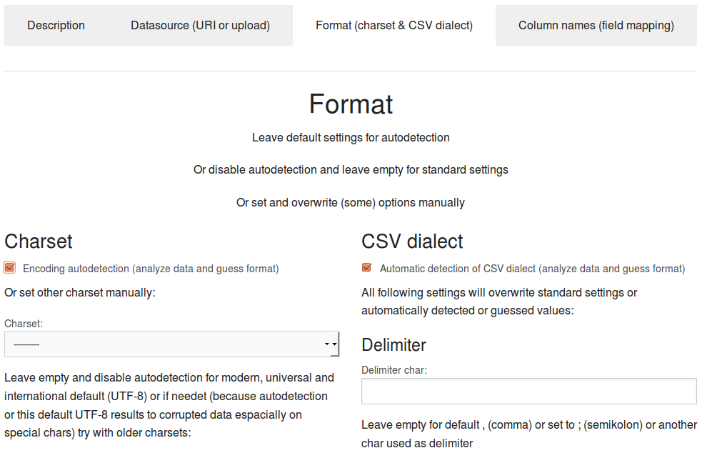

# Managing (very big) CSV spreadsheets and tables

## Import, browse, search and filter structured data from CSV files

If you want search, navigate, browse and filter a CSV spreadsheet even if it is too big for excel or Open Office Calc:

Just copy the CSV file to a [directory with file monitoring](../../../trigger/filemonitoring) or index it the standard way by indexing a [file from your filesystem](../../../connector/files) or [URI from the web](../../../connector/web).

So you are able to search for the content of the CSV file.

If the CSV file is in standard format and the [CSV enhancer](../../../enhancer/csv) is set to on, you can even browse and filter rows and columns using the [table view](../table).

But sometimes you might want to use such additional functionality even if the data is not stored in standard CSV format.

With the webapp [CSV manager](../../../solr-search-csv-python-django) you can set additional metadata (i.e. parameters about the CSV format) with the comfortable user interface:

* If you see, that some chars are not ok, so you have to set the charset manually from default (UTF-8) to another charset
* If the CSV dialect autodetection doesn't work for a special format, you can easily configure custom delimiter and quote chars
* If you want to map columns to existing fields or facets
* If you want to extract column titles from the csv instead of default (column 1, column 2, ...)

## Usage: The CSV user interface

Click the button "Add new csv" in the list view.

### Upload or reference a CSV file

Just upload a csv file to CSV manager or set a reference (URL) to the URI field.

### Set CSV format

If not standard CSV format, set autodetection or overwrite standard settings like delimiter or quote char with custom values:

### Import CSV data to search engine

After saving your CSV settings click the button *"Import"* to import with this settings the data of the CSV file to the search engine.

### Check imported data

After importing check by [table view](../table) if the structure and charset settings were right.

