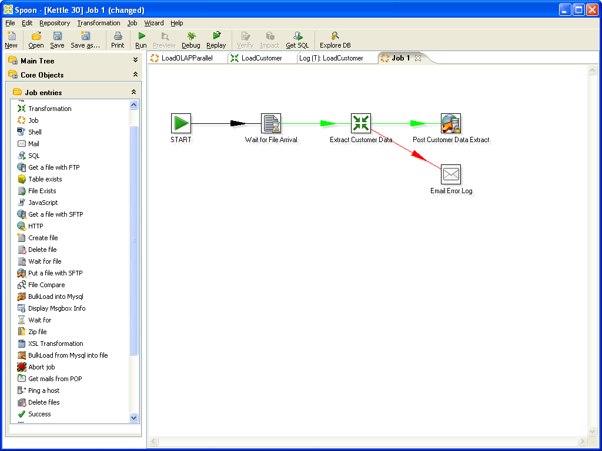
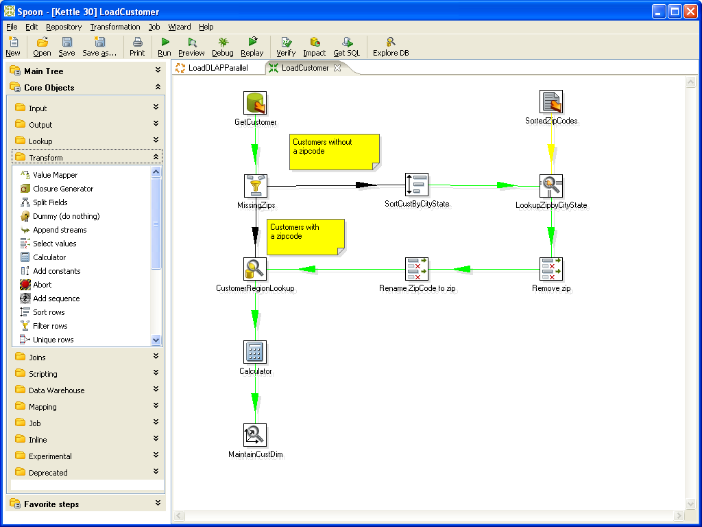

# Open Semantic ETL toolkit for data integration, data analysis, document analysis, information extraction & data enrichment

## Open source frameworks for data integration, document processing, information extraction, data analysis, merging & combining data, content enrichment and data enrichment pipelines

Since most data is available in open standards or extractable by open source software libraries and free software, you can use different open source toolkits or frameworks to extract, transform and load (ETL) data into the search index.

The preconfigured *Open Semantic ETL* is a Python based lightweight, flexible, extendable, modular and interoperable free software and **open source ETL (extract, transform, load), content enrichment and data enrichment framework, toolkit or data enrichment management system** for:
- document processing
- automated content analysis and media analysis
- information extraction
- merge and data enrichment pipelines

It manages multiple, different and modular **import, extraction, content analysis, data combining or data enrichment plugins**.

Since the architecture of the search engine is modular, using open standards for Linked Data and Semantic Web like RDF or SKOS and the basis Elastic Search or Solr providing common standard APIs, you can use or integrate many other alternate Open Source ETL and data analysis tools instead of or in addition to.

## Extract structured data from unstructured documents (information extraction), merge and enrich data with multiple other data sources and data analysis tools

Modular data enrichment plugins (enhancer) extract structured data from even unstructured documents or plain text and enhance or enrich the content with additional meta data or analytics.

## Document processing, document analysis, data integration, content analysis and data enrichment pipeline (Enhancement chain)

The document processing pipeline or chain is a list of data enrichment plugins (enhancer), which will be run for each document to enrich, analyse or link them with additional data or analysis.

A part of the default [document processing pipeline configuration](#config) is for example:
* Crawl a directory and its files and subdirectories
* Filter blacklists (`filter_blacklist`)
* Filter if the file is indexed yet and not modified since last indexing (`filter_file_not_modified`)
* Extract text (`enhance_text`)
* OCR images (`enhance_ocr`)
* Adding annotations and tags (`enhance_rdf`)
* Exporting or indexing to **SQL or NoSQL database** and/or **search index** (f.e. [*Apache Solr*](http://lucene.apache.org/solr) or *[Elastic Search](elasticsearch)* or a *[Linked Data **triplestore** like Apache Jena Fuseki](export/rdf)*)

## Semantic data enrichment plugins

Such modular data enrichment plugins (enhancer) will extract structured data from unstrucutred documents, enhance or enrich the content with additional meta data or analytics.

For example the [named entities extractor](../doc/datamanagement/named_entities) or [OCR for image files](../enhance/ocr).

## Configuration of a custom document processing, content analysis and data enrichment pipeline

If you use only Open Semantic ETL you can use `/etc/etl/config` to setup your data analysis and data enrichment chain and to set a db/exporter/writer to store or index the results (for example *Solr*, *Elastic Search*, a triplestore or a database).

If you use the preconfigured full search engine (Open Semantic Search) the pipeline or the enabled plugins are configured for all data sources in `/etc/opensemanticsearch/etl` or can be overwritten or extended for each data source or connector in their specialized configs like `connector-files`.

The analysis chain runs in order, since some plugins depend on data analysis of other plugins.

You can add additional or new data enrichment plugins to `config['plugins']`.

Or you can overwrite this config option to define a custom data enrichment pipeline with only a few needed plugins.

You can overwrite the config by parameters of the command line tools, for example to use a custom config file or to set the plugin for your data analysis and data enrichment chain.

So you can set a custom config file on the command line with the parameter `--config`, for example:
`etl-file --config */etc/etl/MyCustomConfig* *filename*`

## Usage: Extract, analyze and enrich

Extract, analyze and enrich and export data from files or webpages:

`etl-file *filename*`
to import/extract/analyze/enrich a file

or

`etl-file *directory*`
to import/extract/analyze/enrich all files of a directory and its sub directories

or

`etl-file-monitoring *directory or file*`
for monitoring a directory and import/extract/analyze/enrich new or changed files

or

`etl-web *uri*`
to download a file or webpage from the web and extract, analyze and enrich it

## Enrich parts, enrich later, add additional enrichments, update data enrichments or distributed data enrichment

The tool `etl-enrich` can run data enrichment parts or plugins which are not enabled in your default document processing pipeline later or from time to time.

For example sometimes its better to index all documents without OCR quickly and after that to do the OCR of the documents with images which will take a long time. So the users are able to search in most documents and text, not having to wait until only a few parts and only for a few documents like some text in images are recognized in a long time process first before other documents after them were indexed, which takes only very short time, because there are no images.

Or you can do expensive data enrichment like OCR at night or on a low server load or distribute this work on different processors (parallel processing) or servers (cluster) or web services (cloud).

Another possibility is to enrich with tools or webservices that improved or updated their results because of better analytics quality or more available data from time to time to integrate newer data or analytcs results.

Or to enrich later with an additional webservice, without having to run the full document processing chain again.

Or if a webservice was not available while indexing to enrich data with its analytics later.

### Run additional data analysis or data enrichment plugins

You can run the tool from REST-API or on the command line:
`etl-enrich --plugins *pluginname*`

Optionally you can add a search or filter query, so only the interesting or important data or document(s) will get enriched:
`etl-enrich --plugins *pluginname* --query *query*`

## Enrichment with results of webservices and APIs

You can analyze your data with internal webservices (or if you don't need privacy with external webservices or "the cloud") and read the results with the standard RDF enhancer plugin.

If the webservice results are not in standard Semantic Web formats, but only an API, you can call the API and read the results in your favorite programming language in a custom data enrichment plugin:

## Development of custom data enrichment plugins

You can develop custom data enrichment plugins with a few lines of code using the data enrichment interfaces for Python, Javascript or Java Plugins.

Or you can develop or use a webservice in your favorite programming language and read its results with the standard RDF enhancer plugin.

[Learn more about development of data enrichment plugins](../dev/enhancer) ...

## Scale for big data analysis

If there is big data and you have to index faster, you can [scale by parallel processing, search clusters and optimizing RAM settings](../doc/admin/scale).

## Other frameworks for data integration for data warehouse or for extraction, transformation and load (ETL) or data enrichment

There are powerful open source ETL frameworks (extraction, transformation and load) for data integration, mapping, filtering and transformation for data warehousing with powerful features and graphical user interfaces (GUI).

If there is an output plugin for Solr or if the tools can export data in a format which can be imported by one of our [connectors (crawler, extraction or input plugin)](../doc/admin/connectors), you can use these open source frameworks like [Kettle](http://community.pentaho.com/projects/data-integration/) or [Talend Open Studio](https://www.talend.com/resource/etl-tool.html) to integrate, extract, transform, enrich and load (index) data to the search engine.

## Other data enrichment frameworks based on Semantic Web standards

You can use the [Apache Stanbol](http://stanbol.apache.org/docs/trunk/components/enhancer/) data enrichment framework and one or more of its many [enhancer engines](http://stanbol.apache.org/docs/trunk/components/enhancer/engines/list).

## Transform unstructured documents to semantic linked data

There are not only output/storage/index writer/exporter plugins for search engines like Solr or Elastic Search, but for triplestores, too:

So with its [triplestore storage or output plugins for RDF export](export/solr2rdf) it can integrate unstructured data like document files and document analysis like OCR to [structured Linked Data like RDF graphs and with Semantic Web Tools like a triplestore](#semanticweb) and many other tools working with [open standards for the Semantic Web](#semanticweb).

So it can not only be used for data analysis, data enrichment and merging but as a converter from more or less unstructured document files to linked data like PDF to RDF, Word to RDF, DOC to RDF, OCR to RDF, JPG to RDF, PNG to RDF or as a flexible importer for Semantic Web infrastructure like triplestores.

Or it can be seen as an Semantic Web-API for legacy files, documents or command line data analysis tools serving their data or analysis results to Semantic Web infrastructure.

Another Framework for getting Semantic Web or Linked Data graphs with structured data from unstructured or legacy files are:
* [Linked Pipes ETL](http://etl.linkedpipes.com/): RDF based open source framework for extract transform load (Java)
* [LDIF](http://ldif.wbsg.de/): linked data integration framework
* [Karma](http://usc-isi-i2.github.io/karma/): Data integration tool
* [Silk](http://silkframework.org/): open source framework for integrating heterogeneous data sources
* [Apache Stanbol](http://stanbol.apache.org/docs/trunk/components/enhancer/): Data enrichment framework reads text and serves a RDF graph

## Linked Data and the Semantic Web

Linked Data (LD) or the Semantic Web (Web 3.0) and [Linked Open Data (LOD)](../doc/datamanagement/opendata) based on standard formats like RDF, JSON-LD or Turtle makes data integration, data enrichment and merging data sources easier. Parts of such databases or graphs can be queried and filtered via the query language SPARQL.

The data is available in open standard linked data formats and can be imported to your favorite formats and accessible with your favorite tools, software or library.

## Merging multiple data sources to one graph database

To merge data from different semantic web sources, just load their graphs (database with linked data) into the triplestore (database server) and match or map the properties (in traditional databases this would be columns or data fields).

Your triple store or frameworks, for example OpenRDF, bring some tools to load linked data in RDF or Turtle format into the triplestore.

To download and import external graph databases or external linked data, you can use the Semantic Web ETL frameworks:
* [Unified Views](https://github.com/UnifiedViews): ETL tool for RDF data

## Merging data fields of different data sources and IDs (Entity Mapping)

If the different data sources don't use a common standard for data fields or IDs like Dublin Core or [Wikidata](../doc/datamanagement/opendata):

To merge, connect and map the data fields of different data sources, you can add another graph: an ontology for mapping/connecting different property names or IDs. With the property "Same as" you can map or merge different data sources to one graph.

### Tools and Methods

* Semantic Web: Entity Mapping with properties like *Same As* or [linking different relations of concepts with Simple Knowledge Organisation System (*SKOS*)](../doc/datamanagement/thesaurus)
* [Record linkage](https://en.wikipedia.org/wiki/Record_linkage) (for example with Joins: [Solr Join](https://wiki.apache.org/solr/Join) or [SQL Join](https://en.wikipedia.org/wiki/Join_%28SQL%29) (if same keys or ids in both datasets)) and/or Levensthein distance for similarity
* Open Refine reconcile API

## Open Data sources: Data enrichment with Linked Open Data

Since there are many open data in this open standard formats for linked data, you can enrich your data with many [free knowledge bases like WikiData or DBPedia (the structured database of Wikipedia)](../doc/datamanagement/opendata), which is available via a SPARQL Endpoint.

## Other open source projects

* [Tika](http://tika.apache.org/): Content Analysis Toolkit: extracts content and meta data like author from different document and file formats
* [Apache ManifoldCF](http://manifoldcf.apache.org/): Data integration framework reads different datasources and exports to index
* [Apache UIMA](http://uima.apache.org/) - Pipelines to get structured information out of unstructured documents or data
* [DKPro Core](https://github.com/dkpro/dkpro-core): Provides UIMA components wrapping natural language processing (NLP) tools so they can be used interchangeably in UIMA processing pipelines
* [Kite morphlines](http://kitesdk.org/docs/current/morphlines/): ETL framework to import data to Solr or Hadoop
* [Apache Flume](https://flume.apache.org/): Framework for data pipes
* [Kettle](http://community.pentaho.com/projects/data-integration/): ETL framework with GUI
* [Talend Open Studio](https://www.talend.com/resource/etl-tool.html): ETL framework with GUI
* [Apache NiFi](https://nifi.apache.org/): Automated and managed flow and transformation of information between systems
* [DSWARM](http://www.dswarm.org): Data management platform for enrichment, normalization and linkage of knowledge data structures
* [Europeana Code repository](https://github.com/europeana): ETL tools for Europeana library
* [Scrapy](http://www.scrapy.org): Crawler and data extractor for extracting structured data from websites not providing an API for getting JSON or linked data like RDF but for example HTML without semantic annotations like RDFa
* MapReduceIndexerTool: Indexing many files to Solr faster using a Hadoop cluster (MapReduce is used for parallel processing on a cluster)
* [Freme Project](http://www.freme-project.eu/): Open framework for multilingual and semantic enrichment of digital content

## Methods

* [Data integration](https://en.wikipedia.org/wiki/Data_integration)
* [Extract, transform, load (ETL)](https://en.wikipedia.org/wiki/Extract,_transform,_load)
* [Optical character recognition (OCR)](https://en.wikipedia.org/wiki/Optical_character_recognition)
* [Information extraction](https://en.wikipedia.org/wiki/Information_extraction)
* [Entity Linking](https://en.wikipedia.org/wiki/Entity_linking)
* [Crawling](https://en.wikipedia.org/wiki/Web_crawler)
* [Document processing](https://en.wikipedia.org/wiki/Document_processing)
* [Document automation](https://en.wikipedia.org/wiki/Document_automation)
* [Document modelling](https://en.wikipedia.org/wiki/Document_modelling)