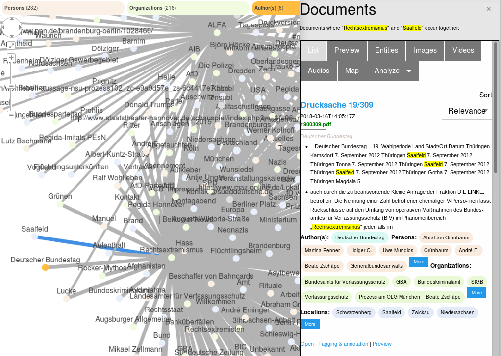

# Open Semantic Visual Graph Explorer for Discovery and Visualization of Linked Data

## Open Source tool and user interface (UI) for discovery, exploration and visualization of a graph

The open source tool Open Semantic Visual Linked Data Knowledge Graph Explorer is a web app providing user interfaces (UI) to discover, explore and visualize linked data in a graph for visualization and exploration of direct and indirect connections between entities like people, organizations and locations in your Linked Data Knowledge Graph (for example extracted from your documents by Open Semantic Search or Open Semantic ETL using Named Entity Extraction and Named Entity Recognition).

## Visualize relations of entities like persons or organizations within and across documents (co-occurrences of named entities)

The [network analysis / graph visualization shows you the relations, connections and networks between named entities like persons, organizations or main concepts which occur together (co-occurrences)](../doc/analytics/graph) in your content, datasources and documents.

## Usage of the Graph User Interface

Read more about the features, [graph user interfaces and how to use them in the documentation](../doc/analytics/graph).

## Free software (Open Source)

The source code of the free software is available in the Git repository [open-semantic-visual-graph-explorer](https://github.com/opensemanticsearch/open-semantic-visual-graph-explorer).

## Integrates Python Django, Apache Solr and Cytoscape.js

The Django web app for discovery, exploration and visualization of a graph integrates a Neo4j graph database (planed) with documents in a Apache Solr search index with the Cytoscape.js graph visualization framework.

## Dependencies

If you do not want to use the preconfigured Debian or Ubuntu packages, you have to setup the following dependencies:

- Python 3 (https://www.python.org/)
- Django (https://www.djangoproject.com/)
- cytoscape.js (Git: https://github.com/cytoscape/cytoscape.js)
- cytoscape.js-panzoom (Git: https://github.com/cytoscape/cytoscape.js-panzoom)
- Foundation (https://foundation.zurb.com/)

### Optional dependencies / integration

Optional dependencies (at least one of them needed) for integrated graph database(s) or faceted search index where your knowledge graph, entities, connections and/or documents are stored:

- Apache Solr (https://lucene.apache.org/solr/)
- Planned: Neo4j (https://neo4j.com)
- Planned: SPARQL triplestore like Apache Jena (https://jena.apache.org/)