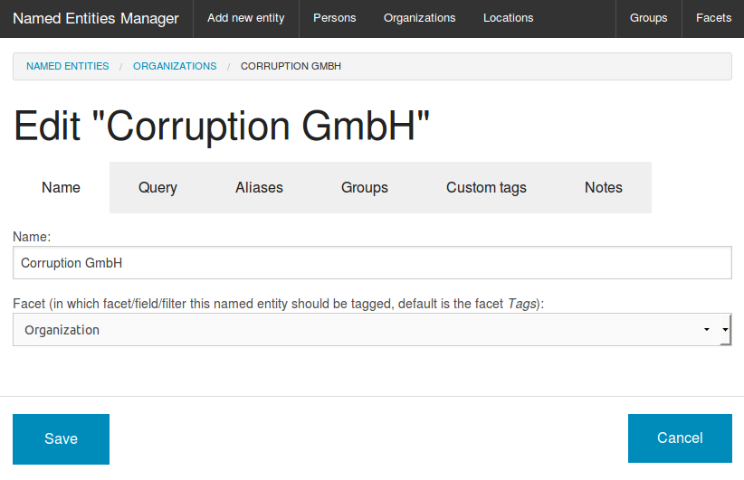
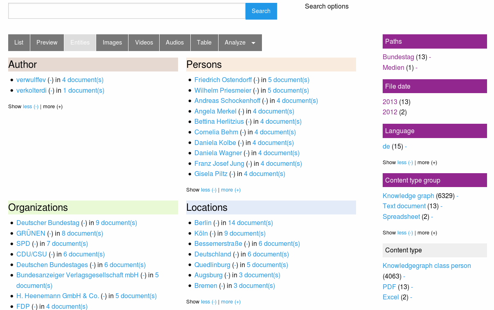
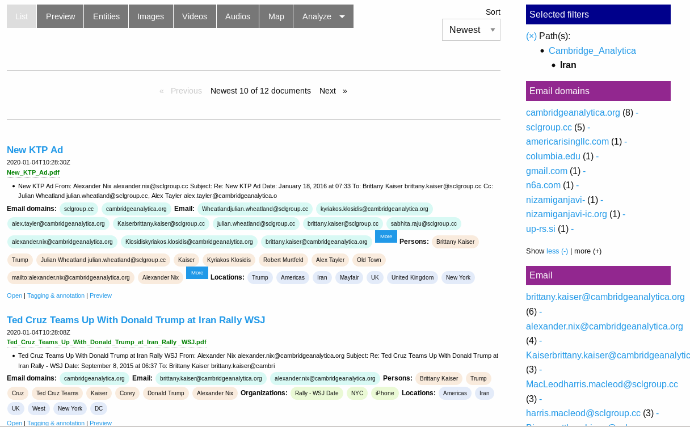
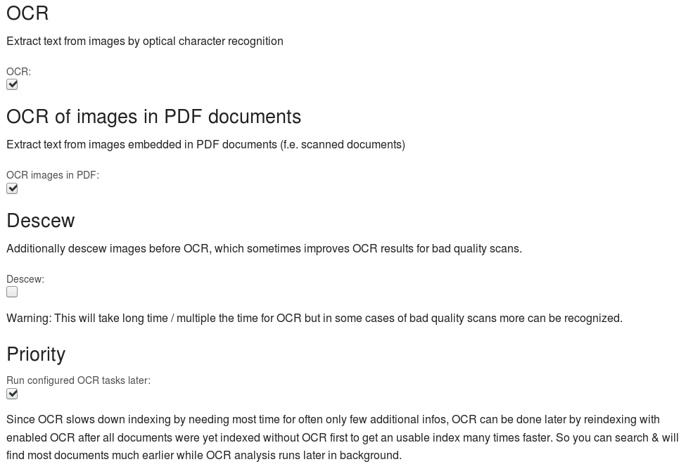
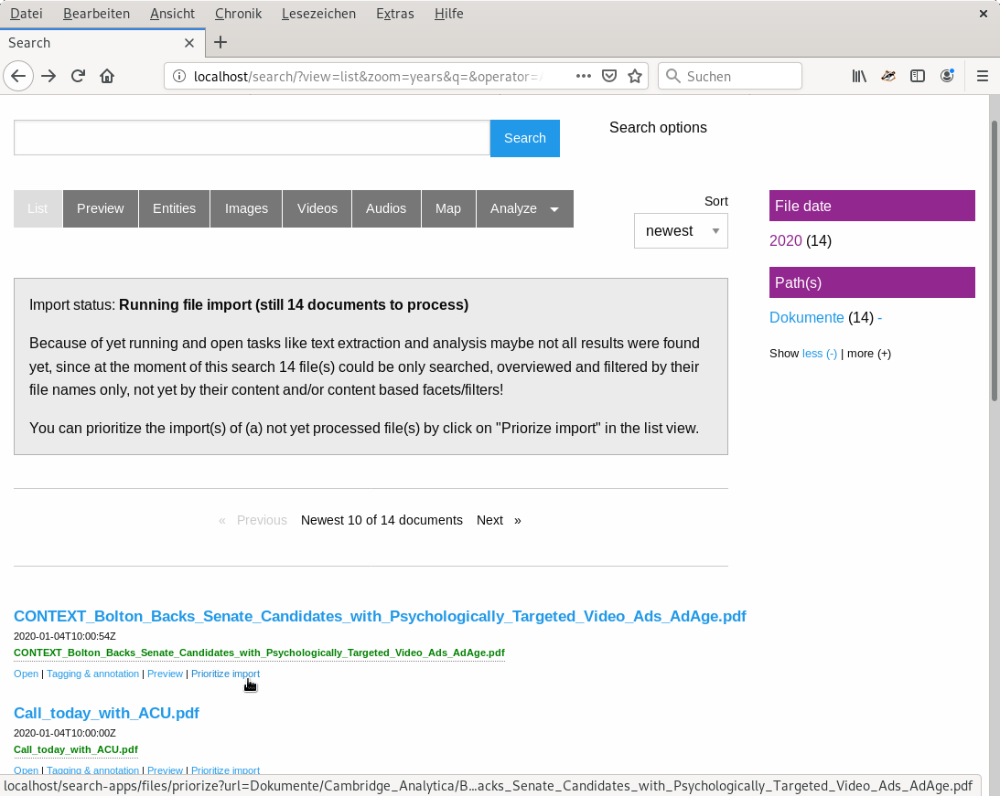
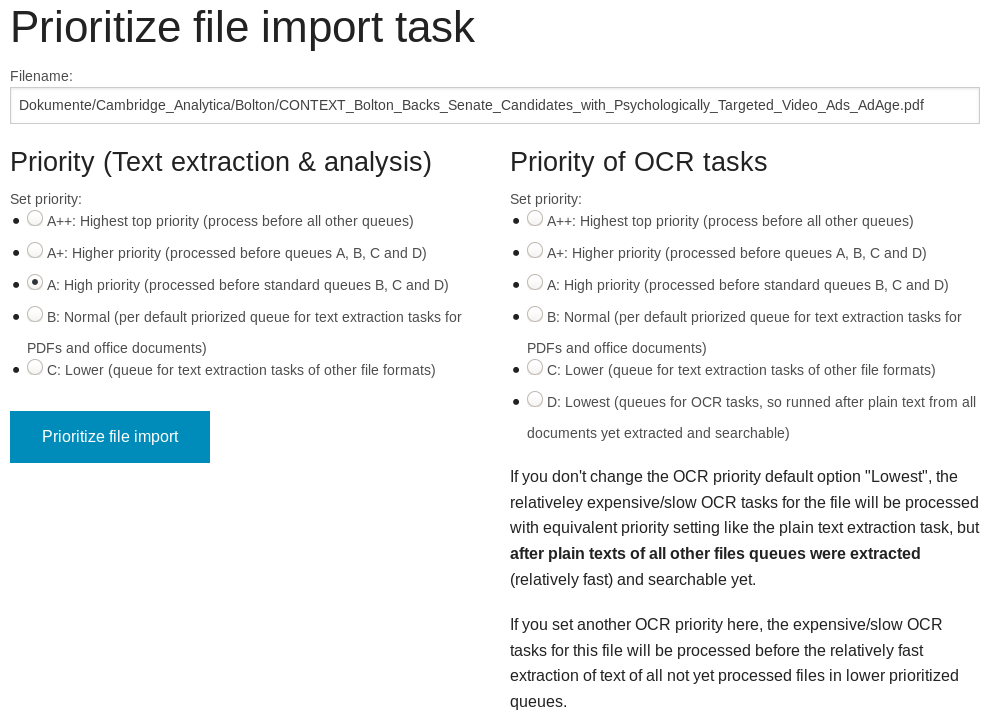
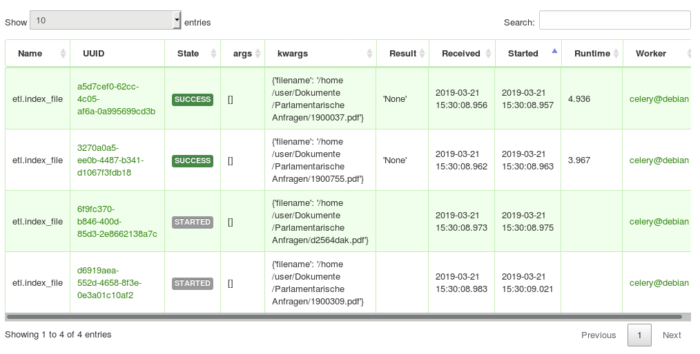

# How investigative journalists can start to investigate, analyze and explore massive leaks of large document collections with many files much faster

A (quick and very dirty and work in progress for coming workshop) tutorial on new UIs (more easier to use UIs planned, so it will be extended and imports of entities will get easier next weeks and months) for faster picking of low hanging fruits in big data leak analysis with limited computing resources:

After an overview of useful and powerful data and text analysis methods (which need [long document processing time on initial import, if very large amount of files](#big-data-leaks-with-large-amounts-of-files-and-text-often-need-long-processing-time)) it describes some [methods, config options and new user interfaces for investigative journalists which empower investigative journalism to pick low hanging fruits of huge leaks faster and start to investigate and analyze a big leak much earlier](#get-low-hanging-fruits-very-fast).

## Free Open Source search tools for leak analysis, exploration and discovery for investigative reporting

There are many powerful and useful research features by free software for information retrieval and integrated open source tools for data analysis to explore and analyze the contents of leaks and document collections by faceted search and overviews, thesaurus, ontologies, lists of named entities (batch search) for automatic entity extraction of known entities and other domain knowledge like important concepts, by machine learning (ML) tools ("artificial intelligence" AI) for natural language processing (NLP) like automatic named entity recognition (NER) of yet unknown entities, [fuzzy search](#fuzzy_search) and other powerful Text mining features which are useful in investigative journalism:

## Full text search

The full text search user interface allows you to search the index with [powerful search operators](../../doc/search/operators) i.e. for `germany OR german* OR deu OR Berlin OR deutsch* OR "Steffan Mappus"` or some other names.

## Privacy and data protection

Analysis, indexing and search runs on your own computer without using cloud services, so what you search for will not be seen, stored and spied by default like on external cloud services.

## Manage named entities like companies or politicians

You can add names (for example companies or politicians) to the [Thesaurus](http://www.opensemanticsearch.org/doc/datamanagement/thesaurus).

## Faceted search (Overview and interactive filters of entities)

This names and concepts in thesaurus, ontologies or lists of names (which investigators with domain knowledge know best and which are often very relevant but an automatic named entity recognition by machine learning fails to recognize them) and/or Named entity recognition by machine learning enables an aggregated overview for this Named Entities like people, organizations or places:

### Extracted people and organizations

### Extracted email addresses, email domains

### Extracted locations and phone numbers

### Extracted lega codes and law clauses

The screenshot shows you how you can use this overviews or how to use named entities as interactive filter to narrow down search results.
So a click to a facet (i.e. an organization) will drill down the search results to fewer documents, matching this additional facet/filter, too.

## How to get this structured facets / overviews and leads by using watchlists and Open Data

But you dont have to add each potential name yourself to add some structure or watchlists like for example names of important people or politicians.
Import [Open Data](../../doc/datamanagement/opendata) to the [Lists and Ontologies Manager](../../doc/datamanagement/ontologies)

### List of names of people of interest like politicians

Get a [list of names of politians from your country for example from Wikipedias structured database Wikidata.](../../doc/datamanagement/opendata/wikidata)
So you get another search facet and overview about this potentialy relevant Names occuring in the documents.

### Open Data list of location names

Another option is to filter by town names of your country:
Get a list of town names of your country, for example from [GeoNames](http://www.geonames.org/), from Openstreetmap or from Wikidata.

So you get another search facet and overview about "Locations" occurring in the documents, which are in your country.

So you can filter for towns in your country and see which people occurre within the documents which maybe are yet unknown and not in your lists of persons but very interesting for the searched context (i.e. your country).

## Fuzzy search

No human writer, no OCR software and no machine learning model is perfect. There are typos in documents, wrong recognized chars by OCR and occurring but not recognized names by Named Entity Recognition by machine learning (its biased statistics not artificial intelligence magic).

So consider to fuzzy search for similar name variants:

As intelligent human considering more cases and conplexity of languages than a dumb computer trying natural language processing by [powerful fuzzy search operators](../../doc/search/fuzzy) or by following UI maybe finding some (but often not as many as a creative human knowing limitations of automatic fuzzy search) useful variants easier:

## Big Data Leaks with large amounts of files and text often need long processing time

Huge leaks can be large document sets with thousands, hundred thousands or millions of document files.

Today it is mostly no problem to search in even such large amounts of documents with modern Open Source research tools even on older hardware like used by many journalists, if the documents are indexed in a open source search engine. Adding and indexing new documents over time is no problem, too, since only new and changed documents will be indexed on a recrawl of your file directories.

But the initial text extraction, OCR and indexing such large document collections with large amounts of files to a search engine can take days or weeks (a former project to index a large document collection for collaborative investigative research took even weeks on modern hardware).

But you don't have to wait such a long time until you can start with investigations in such big leaks:

## Lack of IT admins? More user interfaces (UI) for investigative journalists

Most of the below described features and methods to pick low-hanging fruits very fast had been develped years ago by a powerful modular, flexible and extendable Python based plugin architecture, but they needed Linux admin knowledge on Unix command line tools, Extract Transform Load (ETL) pipelines and related command line tools, most investigative journalists do not have.

Like the last releases, the coming Open Source release in March (testing and improving stuff which yet in public Git repository) will provide additional web user interfaces and new default settings, so some features can be easier used even by freelance journalists or members of a team, if a specialized datajournalist or admin is busy or temporary not available:

### Get low-hanging fruits very fast

Many relevant information can be low-hanging fruits from a computing power perspective.

So Open Semantic Search can run the extraction and analysis of documents in multiple stages:

### Very fast indexing of filenames first

Before the plain text will be extracted from documents, the path names and file names of all documents will be indexed first.

So you can search very early all the path names and filenames while standard text extraction from your documents is yet running.

So you have a faceted search / interactive filters for file paths and file extensions like .pdf for PDF documents or XLS for Excel sheets.

If you on this base find interesting paths or documents, you can [prioritize files](#prioritize-text-extraction-and-ocr-tasks) for running text extraction to enable full text search of the content.

And even in this early stage you may have faceted search for some of the keywords or names from your domain knowledge in thesaurus or lists of names if they occur in this filenames (dependent on file naming).

### Named Entity Recognition (NER) by machine learning (ML) later

Useful Named Entity Recognition of entities (works often even if not yet in your lists of names) by machine learning later needs up to ten times longer than entity extraction by your thesaurus or ontologies.

So this step can be done later after text extraction, too while you are able to fulltext search all your documents earlier and maybe yet work with faster extracted entities from your domain knowledge by thesaurus or ontology based entity extraction.

So set the ML NER plugin to be processed later (next release will have an UI config option "Do NER by ML later" in Config / Named Entity Recognition)

### Slow OCR latest

For most document sets OCR as the slowest task takes most time for mostly only few additional infos.

So the very slow OCR tasks will run after all plain text was extracted from all documents and so you can find most texts (which are stored in text formats in the document files) by full text search much earlier.

This is the new default setting in Config / OCR:

### Prioritize text extraction and OCR tasks

With this first analysis results or even only the path names and filenames you can often early identify potentially interesting files or directories for which you want to prioritize extraction and analysis.

There you can click on "Prioritize" to open an UI where you can set the priority of certain files:

### Share load on multiple computers: Additional parallel ETL workers

Maybe your team have an admin and more computers and servers?

If one computer is slow, for more performance on the initial data import and analysis you can scale by adding additional computers or servers running a Open Semantic ETL Docker container which runs additional parallel workers to share the heavy analysis load between multiple computers.

]
