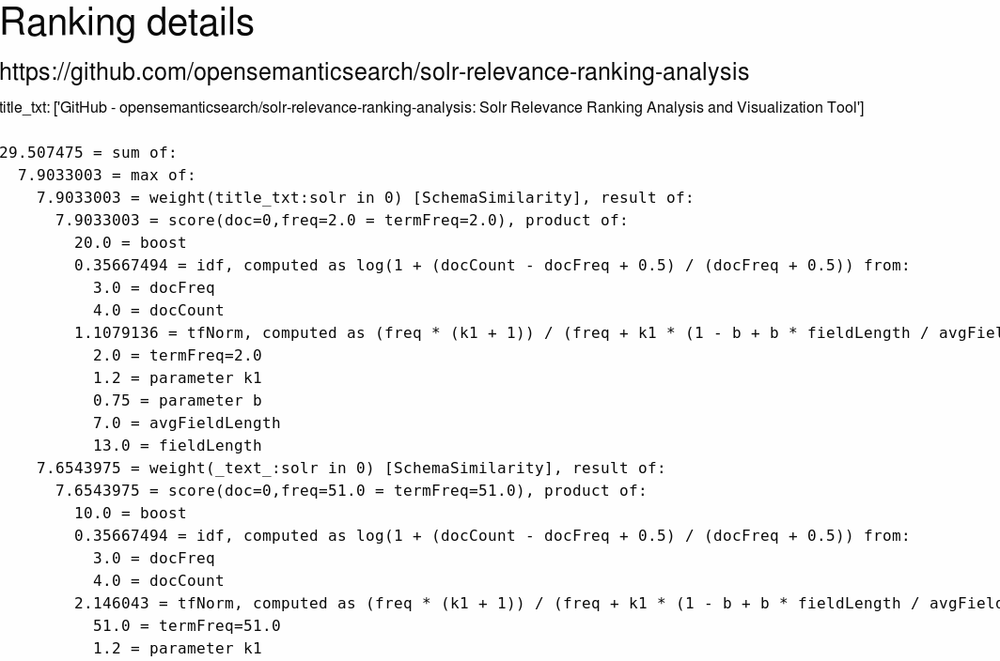
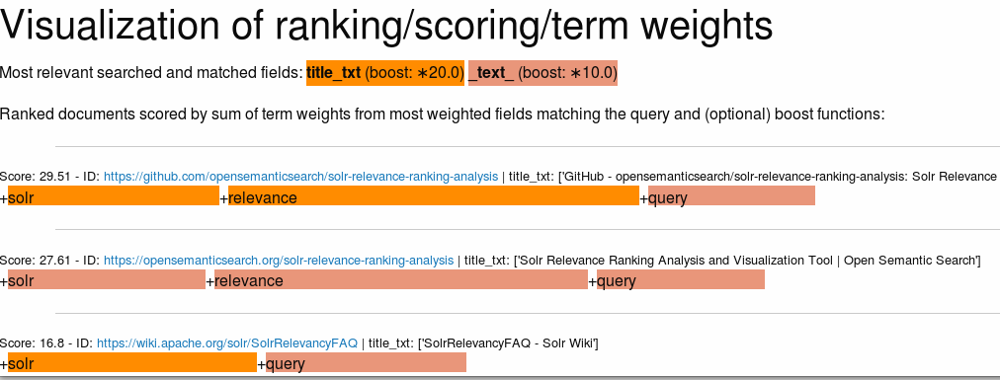

# Solr Relevance Ranking Analysis and Visualization Tool

## Relevance Ranking Analysis and Visualization for easier Solr relevancy tuning

This Python Django based Open Source tool and web user interface (UI) allows for easier [Solr Relevancy](https://wiki.apache.org/solr/SolrRelevancyFAQ) analysis and is helpful while one is performing search relevance tuning and relevancy ranking debugging.

The tool summarizes and visualizes the relevance ranking and scoring by [field boosts](https://lucene.apache.org/solr/guide/7_6/the-dismax-query-parser.html#qf-query-fields-parameter) (qf), term weights (TF/IDF) and the [boost function](https://lucene.apache.org/solr/guide/7_6/the-dismax-query-parser.html#bf-boost-functions-parameter) (bf) score of documents found by an Apache Solr search query.

## Usage

Open the web user interface (UI) on the server/port/path you run this Django web app (see section "Installation").

Copy the full Solr query (URL) to the field "Query" of the form in the web user interface (UI)

Click the button "Analyze relevance ranking"

## Visual summary

So you get a visual summary of the relevance ranking of the found documents:

## Ranking details

By clicking the button "Show details" you get the full details of the scoring calculation for each document:

## Visualization

The button "Chart" in the top bar shows a more compact visualization:

## Installation and configuration

The tool can be used with other [Apache Solr](http://lucene.apache.org/solr/) environments than Open Semantic Search.

You can find the documentation on installation and configuration in the [README.md](https://github.com/opensemanticsearch/solr-relevance-ranking-analysis).

## Free Open Source Software

The tool is Free Software. You can find the full [Source Code on GitHub](https://github.com/opensemanticsearch/solr-relevance-ranking-analysis)
